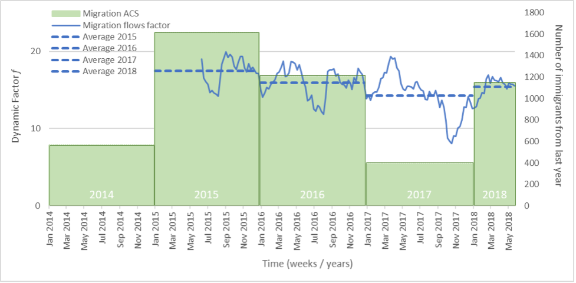
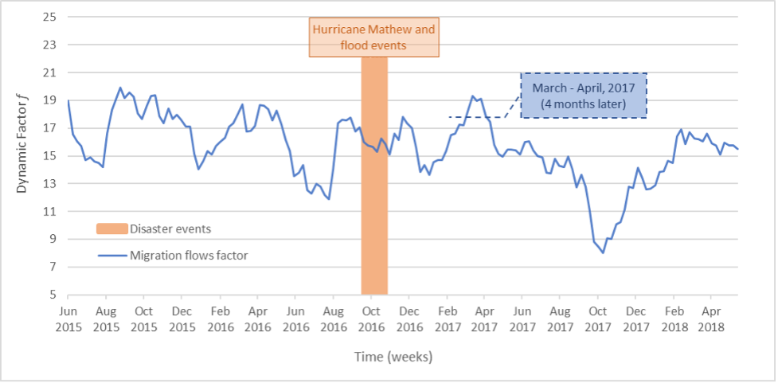

# Real-Time Tracking of Intra-Regional Migration from the Caribbean to Puerto Rico after Extreme Events

### Terms:

American Community Survey (ACS)

Dynamic Factor Model (DFM)

Part of Speech (POS)

Named Entity Recognition (NER)

## Project Description
A frequent effect of extreme events is the movement of populations across national borders, which is particularly relevant in the Caribbean where intra-regional migration accounts for almost 4% of the total population. 
The uncertainty and unpredictability in the numbers of immigrants into Puerto Rico, and their health conditions upon arrival, can easily overload the capacity and seriously jeopardize the effectiveness of the island’s public and private health organizations. 
The underlying problem is the lack of real-time post-event (disaster) impact data to track international migration in the Caribbean, which raises uncertainty levels and presents major problems for health sector preparedness, response, and decision-making.
we develop and test the feasibility and validity of an innovative method utilizing internet-derived “big data” to track international migration flows. 

### Data 
Research uses public anonymized data derived from Twitter and Google Trends, and public de-identified national data (ACS). 

## Research Question

- Research Question 1: Is it feasible to use internet data to generate a variable that measures migration flows to Puerto Rico from different Caribbean countries?

- Research Question 2: Is the migration flows variable a valid real-time estimator of migration? In particular, are the modelled estimations of immigration flows to Puerto Rico from Dominican Republic after the 2016 Hurricane Mathew close to the observed flows as evidenced by Census data?

## Method

Our method builds on recent evidence that emigrating and non-emigrating populations from the same source country remain culturally connected, mostly through internet activities.

We develop a three-step approach :  
- first identifies a set of keywords specific to the source country affected by an extreme event. 
- Second, we obtain search trends for all country-specific keywords in the receiving/host area at a weekly frequency. 
- Finally, we estimate a dynamic factor common to all country-specific keywords, which aggregates a broad scope of search interests on the source country searched in a host geographic area. We use this factor as a proxy for migration flows from Dominican Republic to Puerto Rico.

To test the feasibility of our approach and validate our method, we compared our estimated migration flows factor with annual census data, showing a 95.5% correlation. 

## Technology

- Data Extraction
  - Country-Specific Keywords
    - Data Collection and Data Preprocessing
    - POS
    
      POS is a category of words that have similar grammatical properties and explains how a word is used in a sentence.
    - NER
 
      NER is the task of recognizing and demarcating the segments of a document that are part of a name.
    - TF-IDF
    
      we used the Term Frequency (TF) and Inverse Document Frequency (IDF) algorithms to weigh a keyword x in the content of a document and assign its importance based on the number of times it appears in the document. TF is used to measure how many times keyword x is present in a document. Since every document is different in length, it is possible that a keyword would appear more often in long documents than in shorter ones (Hakim, Erwin, Eng, Galinium, & Muliady, 2014). Thus, the TF is often divided by the document length as a way of normalization.
      
    
    

  - Keyword Trends
    we obtain search volumes of each of the S keywords obtain search volumes in Puerto Rico for each of the S keywords from Dominican Republic and other comparison source countries. 
    We used Google Trends, an application of Google that analyzes the search terms’ trends over time for different geographies. It shows real-time search trends and weekly historical search trends for every city in the world. 
    A search score x is a normalized search volume index for keyword x that ranges from 0 (low volume searches) to 100 (highest volume searches). We obtain a large set of country-specific search scores Xt searched in Puerto Rico, where t represents weeks from June 2016 to June of 2018.
    
  - Migration Flows Variable
- Dynamic Factor Model (DFM) (Stock & Watson, 2011), a time-series econometric technic that allows to (1) obtain the unobserved common factor (ft), and (2) reduce the large dimension of Xt from S to one common factor.

## Result 
Our preliminary results showed a peak in migration flows from Dominican Republic to Puerto Rico 4 months after Hurricane Mathew. 
It also detected a sharp fall in migration flows between September and November 2017, when Hurricane Maria devastated Puerto Rico. 
Our preliminary results require further statistical analysis, but they are promising. Our nowcasting model offers the possibility of tracking intra-regional immigration flows to Puerto Rico in real-time. 
The tool has the potential to help local health departments and private organizations reduce the uncertainty of migrant inflows and thereby better allocate public health resources to protect both vulnerable migrants and Puerto Rican residents.
